# The Seamless Handoff: Integrating Einstein Enhanced Bot with Agentforce Agent

[cite_start]This repository documents the strategic fusion of **Einstein Bot's** rule-based triage with **Agentforce AI's** adaptive intelligence[cite: 3]. [cite_start]This "Hybrid Bot" solution ensures high-volume inquiries are handled efficiently while complex issues are resolved by an autonomous agent with deep context[cite: 4, 5].

## Overview

[cite_start]**The Problem:** Achieving unified, intelligent customer service that balances efficiency with personalized resolution[cite: 9].

**The Solution:**
1.  [cite_start]**Einstein Bot Classic:** Streamlines high-frequency inquiries (e.g., Log Case, Status Check)[cite: 10].
2.  [cite_start]**Agentforce Agent:** Handles specialized knowledge-based questions and complex multi-step actions using LLMs[cite: 11].

### Architecture
The architecture routes user input through an Inbound Omni-Channel Flow to the Einstein Bot. Simple requests are handled via Flow/Apex, while complex queries are transferred via an Outbound Omni-Channel Flow to the Agentforce Agent.

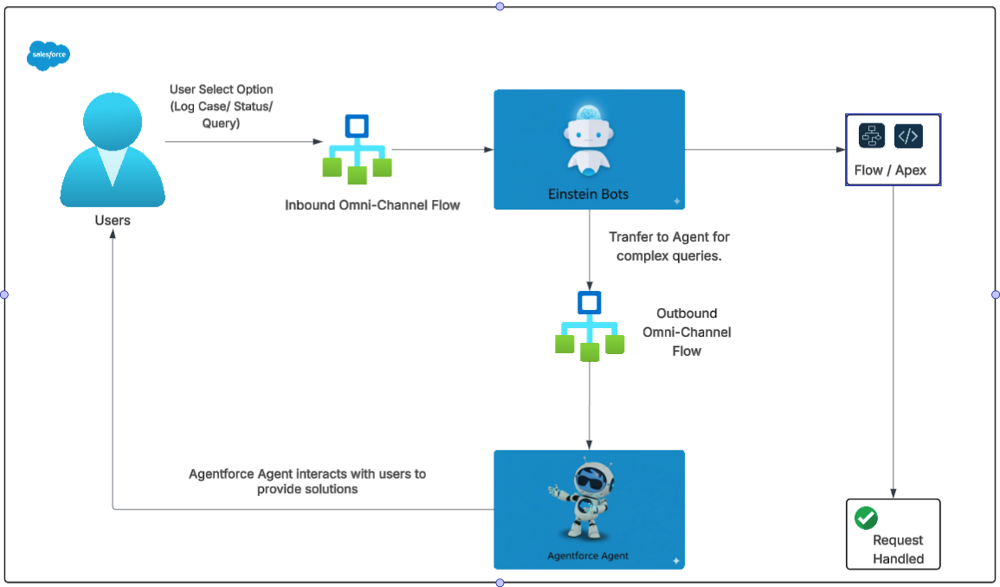
[cite_start]*Figure 1: Hybrid Bot Architecture showing the flow between Einstein Bot and Agentforce Agent[cite: 12, 13, 14, 16, 17].*

---

## Configuration Guide

### Step 1: Configure Agentforce Service Agent

1.  [cite_start]**Create Data Library:** Create an Agentforce Data Library, set the Data Type to 'file', and upload support policy/FAQ PDF documents[cite: 23].

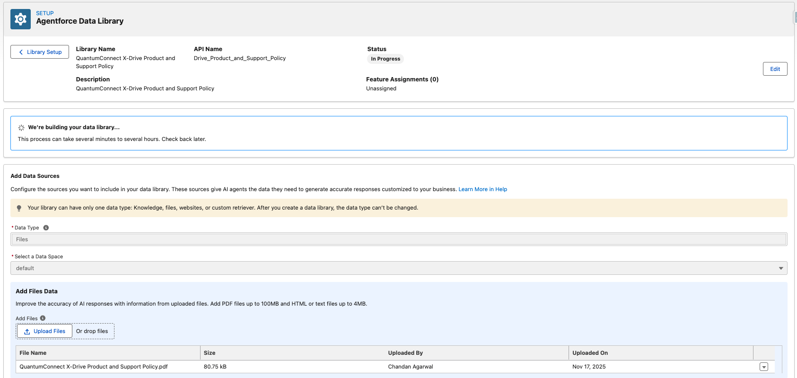
[cite_start]*Figure 2: Configuring the Agentforce Data Library[cite: 24].*

2.  [cite_start]**Create Agent:** Create a "Unified Resolution Agent"[cite: 53].
3.  [cite_start]**Configure Agent:** Add the Data Library, define Topics/Instructions, and assign the 'Answer Questions with Knowledge' action[cite: 54, 55].

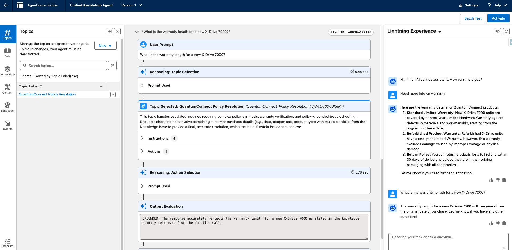
[cite_start]*Figure 3: Testing the Agentforce Agent's ability to retrieve warranty policy from the library[cite: 87].*

### Step 2: Configure Einstein Enhanced Bot ("Astro Case Resolution")

[cite_start]Create a new Enhanced Bot named **Astro Case Resolution**[cite: 91].

**1. Case Status Dialog:**
* Add a question to get the user's email.
* Add an Action to run the "Get Case Details" flow.
* [cite_start]Add a Message component to display the status[cite: 94, 95, 96, 98].

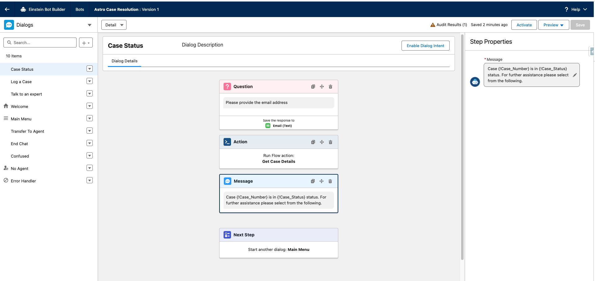
[cite_start]*Figure 4: Case Status Dialog Configuration[cite: 125].*

**2. Log a Case Dialog:**
* Collect Email and Problem Statement via Question components.
* Call the "Create a case flow".
* [cite_start]Display the generated Case Number[cite: 126, 127, 129, 130].

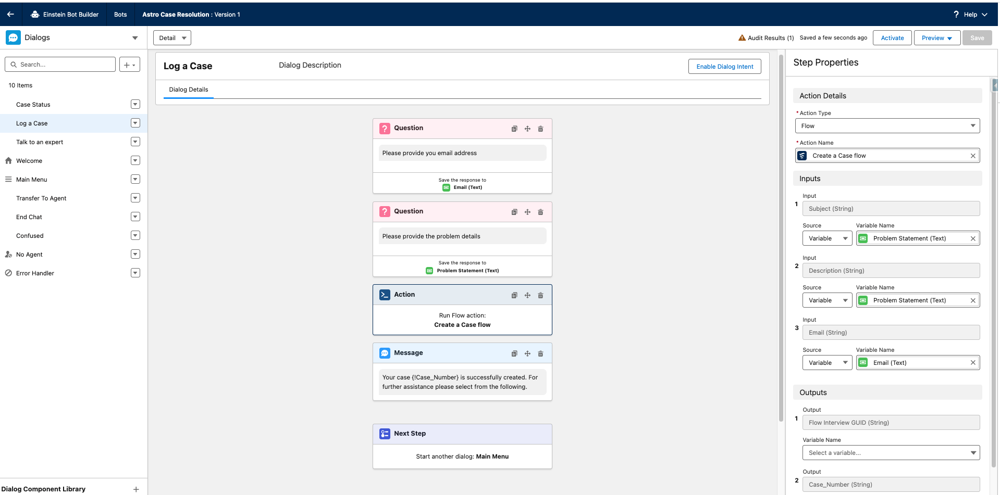
[cite_start]*Figure 5: Log a Case Dialog Configuration[cite: 142].*

**3. Talk to an Expert Dialog:**
* [cite_start]Set the Next Step to "Transfer to Agent"[cite: 143].

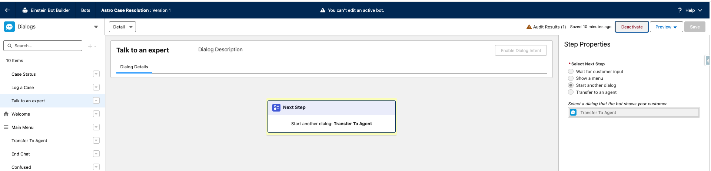
[cite_start]*Figure 6: Talk to an Expert Dialog Configuration[cite: 156].*

### Step 3: Configure Omni-Channel Routing

To enable the handoff, you must configure the Omni-Channel flow.

1.  [cite_start]**Create Queue:** Create a queue (e.g., "GPO Fallback") and add the Agentforce Service Agent user to it[cite: 158, 160].
2.  [cite_start]**Create Omni-Channel Flow:** Create a "Route Work" step that routes to the **Agentforce Service Agent**[cite: 162].

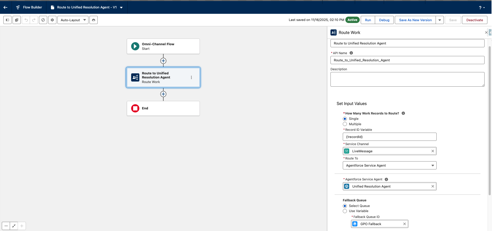
[cite_start]*Figure 7: Omni-Channel flow transferring chat to Unified Resolution Agent[cite: 175].*

3.  [cite_start]**Bot Overview Settings:** In the Einstein Bot Overview, set the **Outbound Omni-Channel Flow** to the flow created above[cite: 177].

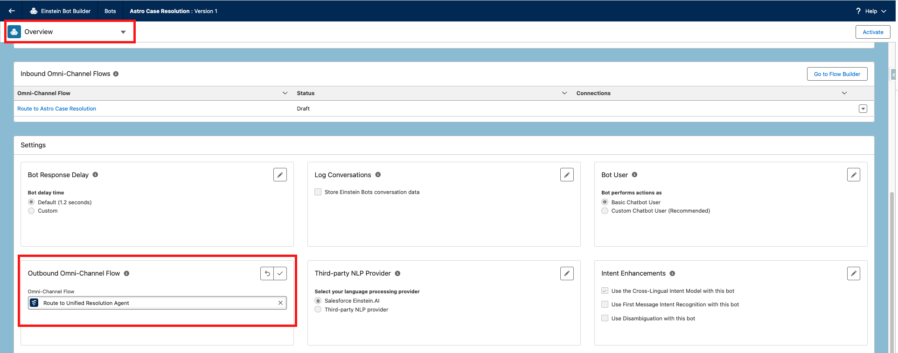
[cite_start]*Figure 8: Setting the Outbound Omni-Channel flow[cite: 188].*

4.  [cite_start]**Transfer Dialog Rules:** In the "Transfer To Agent" dialog, add a Rule Action to set the Route Destination to the "Route to Unified Resolution Agent" flow[cite: 190].

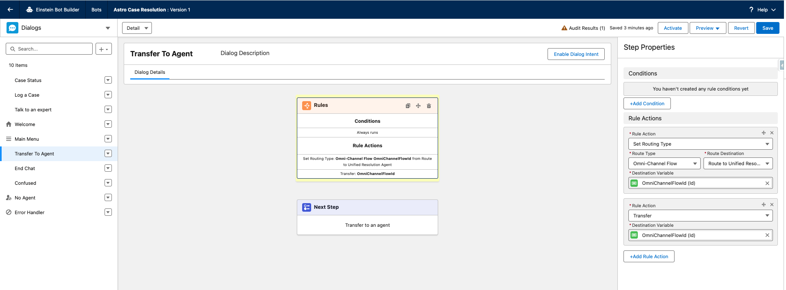
[cite_start]*Figure 9: Configuring the Transfer To Agent dialog rules[cite: 200].*

### Step 4: Deploy to Experience Cloud

**1. Inbound Omni-Channel Flow:**
[cite_start]Ensure the system-generated Inbound Omni-Channel flow falls back to the "GPO Fallback" queue[cite: 203, 204].

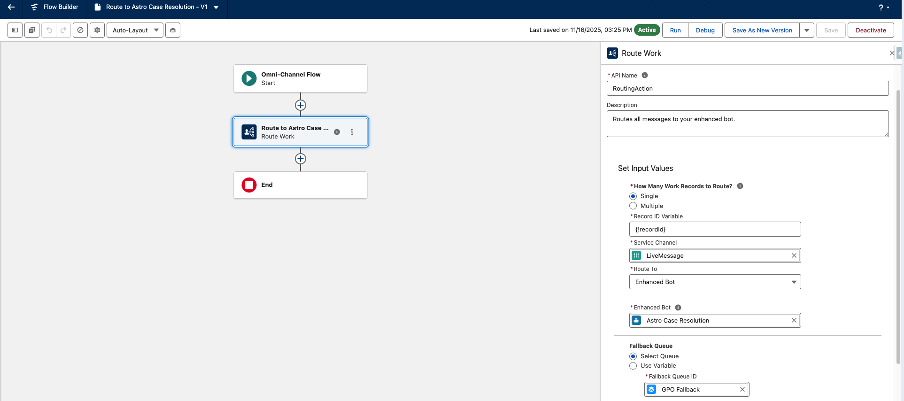
[cite_start]*Figure 10: Inbound Omni-Channel flow configuration[cite: 215].*

[cite_start]Review the bot's overview to confirm the connection[cite: 216].

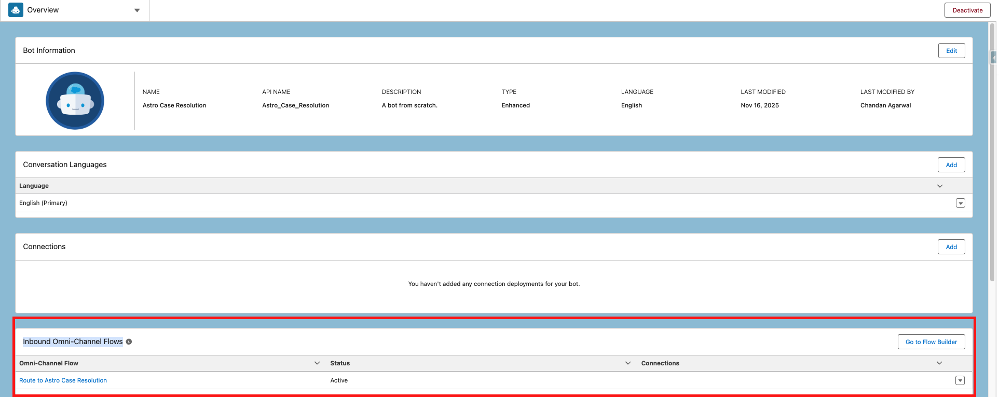
[cite_start]*Figure 11: Inbound Omni-Channel Flow verification[cite: 222].*

**2. Create Messaging Channel:**
In Setup, create a new **Enhanced Chat** channel (Messaging for In-App and Web). [cite_start]Set the routing type to "Omni-flow" pointing to the *Inbound* flow[cite: 224, 228].

[cite_start]*Figure 12: Messaging for In-App and Web configuration[cite: 240].*

**3. Embedded Service Deployment:**
[cite_start]This is automatically created when defining the Messaging Channel[cite: 242].

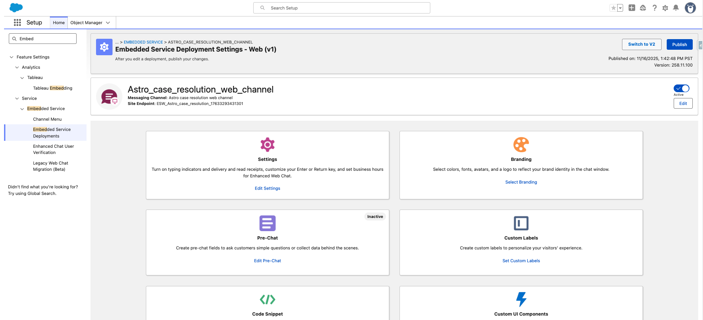
[cite_start]*Figure 13: Embedded Service Deployment Settings[cite: 252].*

**4. Experience Cloud Setup:**
[cite_start]Drag the **Embedded Messaging** component onto your Experience Cloud site and link it to the web deployment[cite: 254, 255].

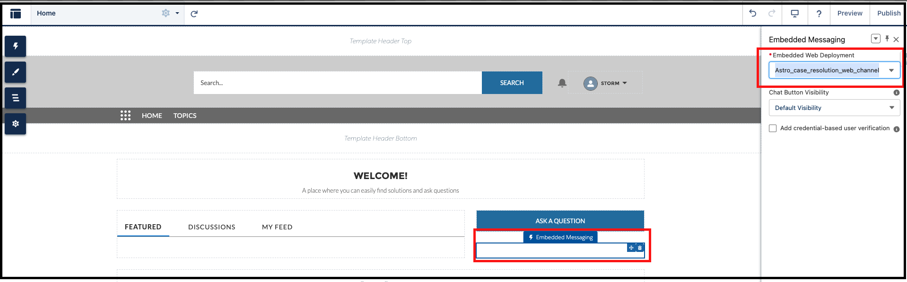
[cite_start]*Figure 14: Embedded Messaging component on the site[cite: 266].*

---

## Testing the Hybrid Bot

**Scenario A: Standard Transaction (Einstein Bot)**
The user initiates a chat and selects **Case Status**. The Einstein Bot collects the email and returns the status via the flow.

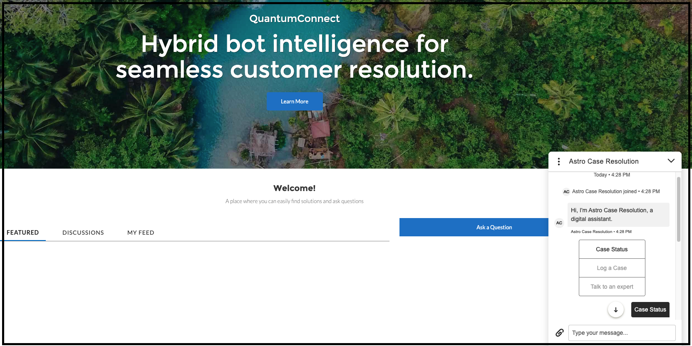
[cite_start]*Figure 15: User selecting Case Status from the menu[cite: 284].*

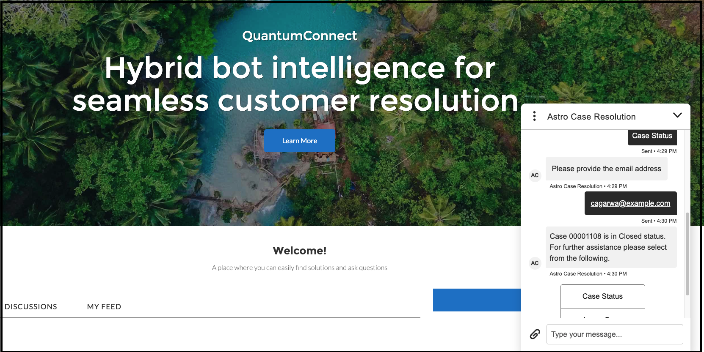
[cite_start]*Figure 16: Bot providing case number and status[cite: 308].*

**Scenario B: Complex Inquiry Handoff (Agentforce)**
The user selects **Talk to an expert**. [cite_start]The chat is transferred to the Unified Resolution Agent, which answers a warranty question using the knowledge base[cite: 309, 325].

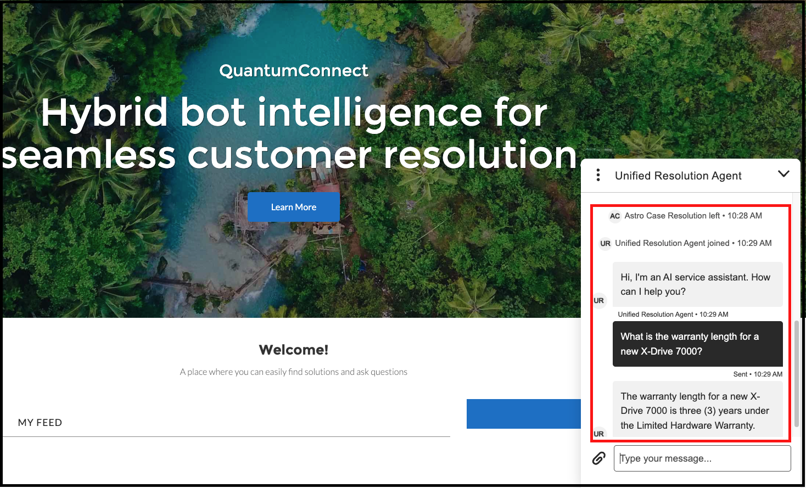
[cite_start]*Figure 17: Conversation transferred from Astro Bot to Unified Resolution Agent[cite: 327].*

---

## Conclusion
[cite_start]This architecture allows companies to redefine service by achieving the efficiency of automation for routine tasks while guaranteeing sophisticated resolution for complex interactions[cite: 6].

### Authors
* [cite_start]**Chandan Agarwal**: Lead Member of Technical Staff at Salesforce[cite: 343].
* [cite_start]**Ishita Saxena**: Senior Solution Consultant at Salesforce[cite: 344].
